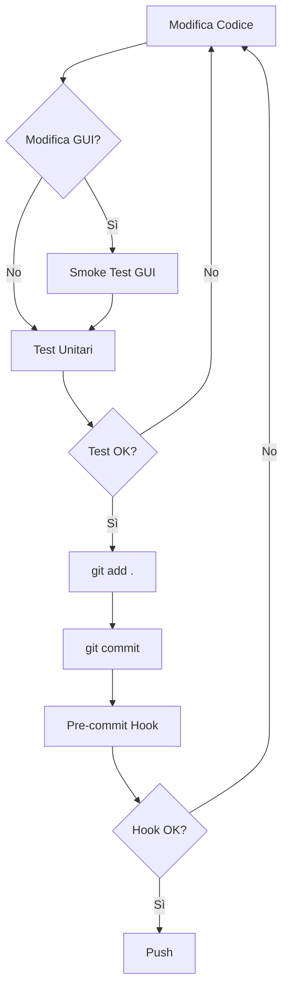

# Guida Sviluppo Sicuro - Peptide Manager

## 🎯 Obiettivo
Prevenire regressioni accidentali come quella del commit `9817859`.

---

## ⚡ Quick Start

### Prima volta (setup):
```powershell
# 1. Installa git hooks
python scripts/install_hooks.py

# 2. Esegui test per verificare tutto ok
python -m pytest tests/test_gui_dialogs.py -v
```

### Prima di ogni commit:
```powershell
# 1. Esegui smoke test GUI (se hai modificato gui.py)
python scripts/smoke_test_gui.py

# 2. Esegui test automatici
python -m pytest tests/ -v

# 3. Commit (hook pre-commit farà validazione automatica)
git add .
git commit -m "Fix: descrizione chiara"
```

---

## 📋 Checklist Pre-Commit

### Per modifiche a GUI (gui.py):
- [ ] Eseguito `python scripts/smoke_test_gui.py` → PASS
- [ ] Testato manualmente ogni dialog modificato
- [ ] Verificato che tutti i pulsanti funzionino
- [ ] Nessun crash all'apertura dell'app

### Per modifiche a Dialog:
- [ ] Dialog si apre correttamente
- [ ] Dialog ha tutti i campi necessari
- [ ] Pulsanti "Annulla" e "Conferma" funzionano
- [ ] Dialog si chiude dopo l'azione
- [ ] Test automatico aggiunto/aggiornato

### Per refactoring massicci (>100 righe):
- [ ] Commit splittati per funzionalità separata
- [ ] Ogni commit testato individualmente
- [ ] Smoke test eseguito dopo ogni commit
- [ ] Backup pre-refactoring creato

### Per modifiche al backend:
- [ ] Test unitari esistenti passano
- [ ] Nuovi test aggiunti per nuove funzionalità
- [ ] Floating point: usato `round(value, 2)`
- [ ] SQL: usato `ROUND(column, 2)`

---

## 🛡️ Protezioni Automatiche

### 1. Pre-commit Hook
Installato con `python scripts/install_hooks.py`

**Verifica automaticamente:**
- ✅ Sintassi Python corretta
- ✅ Dialog GUI completi (AlertDialog + open + update)
- ✅ Dimensione commit (warning se >200 righe)

**Saltare l'hook (solo emergenze):**
```powershell
git commit --no-verify -m "Emergency fix"
```

### 2. Test Automatici
File: `tests/test_gui_dialogs.py`

**Eseguire:**
```powershell
# Tutti i test
python -m pytest tests/ -v

# Solo test GUI
python -m pytest tests/test_gui_dialogs.py -v

# Test specifico
python -m pytest tests/test_gui_dialogs.py::test_add_preparation_dialog_has_alertdialog -v
```

### 3. Smoke Test GUI
File: `scripts/smoke_test_gui.py`

**Quando usarlo:**
- Prima di commit che modificano `gui.py`
- Dopo refactoring massicci
- Prima di deploy production

---

## 🚫 Anti-Pattern da Evitare

### ❌ Commit troppo ampi
```
BAD: "Fix multi-prep, dashboard, floating point, dialog issues"
     (3 file, 176 righe rimosse, 89 aggiunte)
```

### ✅ Commit atomici
```
GOOD: "Fix: Multi-prep FIFO distribution logic"
      (1 file: peptide_manager/__init__.py)

GOOD: "Fix: Floating point rounding in administration"
      (1 file: peptide_manager/models/administration.py)

GOOD: "Refactor: Dashboard layout reorganization"
      (1 file: gui.py)
```

### ❌ Refactoring senza test
```python
# Prima: funziona
def show_dialog(self):
    ...
    dialog = ft.AlertDialog(...)
    self.page.overlay.append(dialog)
    dialog.open = True
    self.page.update()

# Dopo refactoring: ROTTO (mancano ultime 4 righe)
def show_dialog(self):
    ...
    # ??? Dove è finito il resto?
```

### ✅ Refactoring incrementale con test
```powershell
# 1. Aggiungi test PRIMA di refactoring
python -m pytest tests/test_gui_dialogs.py -v  # PASS

# 2. Fai refactoring piccolo
# Modifica gui.py

# 3. Verifica che test passino ancora
python -m pytest tests/test_gui_dialogs.py -v  # PASS

# 4. Commit incrementale
git commit -m "Refactor: Extract dialog fields to separate method"
```

---

## 📊 Metriche di Qualità

### Commit Sani:
- **Dimensione**: <100 righe modificate
- **Scope**: 1 problema = 1 commit
- **File**: preferibilmente 1-2 file
- **Test**: tutti i test passano
- **Review**: self-review prima del push

### Commit a Rischio:
- **Dimensione**: >200 righe → split consigliato
- **Scope**: multiple feature/fix → split obbligatorio
- **File**: >3 file → review attenta
- **Test**: test skippa o fail → FIX BEFORE COMMIT

---

## 🔧 Tool Rapidi

### Verifica stato progetto:
```powershell
# Test coverage
python -m pytest tests/ --cov=. --cov-report=term

# Controllo sintassi
python -m py_compile gui.py

# Lint (se configurato)
flake8 gui.py
```

### Debug regressioni:
```powershell
# Trova ultimo commit funzionante
git log --oneline --all -- gui.py

# Confronta con versione precedente
git diff HEAD~1 gui.py

# Mostra file in commit specifico
git show <commit-hash>:gui.py
```

### Backup pre-refactoring:
```powershell
# Crea branch backup
git branch backup-before-refactor

# Oppure commit WIP
git add .
git commit -m "WIP: Before major refactoring"
```

---

## 🆘 Recovery da Regressione

### Se scopri un bug dopo commit:

1. **Identifica commit colpevole:**
   ```powershell
   git log --oneline -- gui.py
   git show <commit-hash>:gui.py | Select-String "def show_add_preparation_dialog" -Context 0,50
   ```

2. **Fix immediato:**
   ```powershell
   # Ripristina file da commit funzionante
   git show <good-commit>:gui.py > gui.py.backup
   
   # Copia codice mancante
   # Fix manualmente
   
   # Commit fix
   git add gui.py
   git commit -m "Fix: Restore missing dialog code (regression from <bad-commit>)"
   ```

3. **Documenta in LESSONS_LEARNED.md**

---

## 📚 Risorse

- **Test**: `tests/test_gui_dialogs.py`
- **Hooks**: `scripts/install_hooks.py`
- **Smoke Test**: `scripts/smoke_test_gui.py`
- **Lessons Learned**: `LESSONS_LEARNED.md`

---

## ✅ Workflow Ideale



---

**Ricorda**: 15 minuti di test ora = ore di debug risparmiate domani! 🎯
